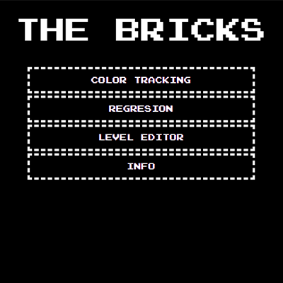

# Breakout-game
## _School project 2/5_
the game can be played on the keyboard or with the help of a camera (color tracking or artificial intelligence).

This project was created with HTML5, CSS3, JavaScript (libraries P5.js, ML5.js, sweetalert2.js).

